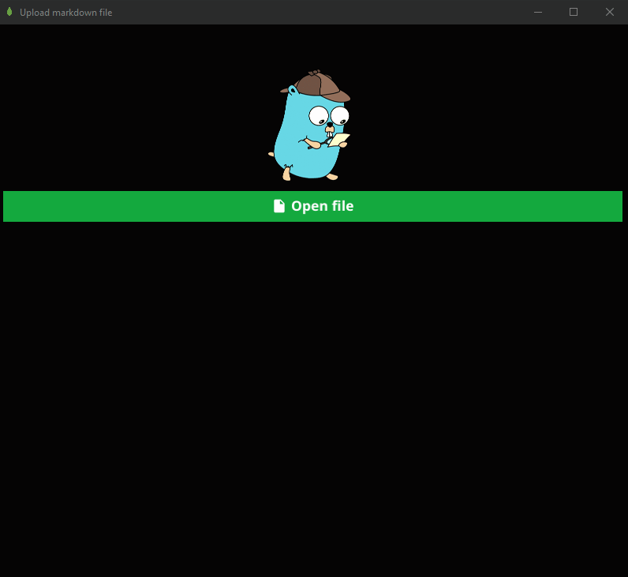

# Markdown file upload to MongoDB with GUI

## Introduction

This is purely a personal project where I wanted to create a simple GUI with [Fyne](https://fyne.io) to upload markdown files to my Mongo Database collection. Database I use as a resource for my another website, where I have my notes available.

Theme for Fyne app was provided with [Fyne Theme Generator](https://github.com/lusingander/fyne-theme-generator).

### Demo

